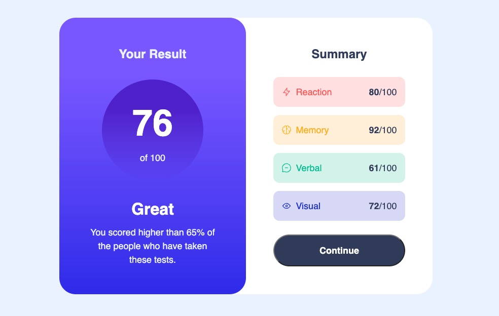

# Frontend Mentor - Results summary component solution

This is a solution to the [Results summary component challenge on Frontend Mentor](https://www.frontendmentor.io/challenges/results-summary-component-CE_K6s0maV). Frontend Mentor challenges help you improve your coding skills by building realistic projects.

## Table of contents

- [Overview](#overview)
  - [The challenge](#the-challenge)
  - [Screenshot](#screenshot)
  - [Links](#links)
- [My process](#my-process)
  - [Built with](#built-with)
  - [Useful resources](#useful-resources)

**Note: Delete this note and update the table of contents based on what sections you keep.**

## Overview

### The challenge

Users should be able to:

- View the optimal layout for the interface depending on their device's screen size
- See hover and focus states for all interactive elements on the page
- **Bonus**: Use the local JSON data to dynamically populate the content

### Screenshot

### Links

- [Solution URL](https://github.com/cbrands/fm-results-summary-component)
- [Live site URL](https://cbrands.github.io/fm-results-summary-component/)

## My process

## My process

### Built with

- Semantic HTML5 markup
- Sass
- Flexbox
- BEM
- Mobile-first workflow

### Useful resources

- [Flexbox Simplified](https://www.flexboxsimplified.com/) - An excellent Flexbox resource.
- [Beyond CSS](https://www.beyondcss.dev/) - I am learning Sass here.
